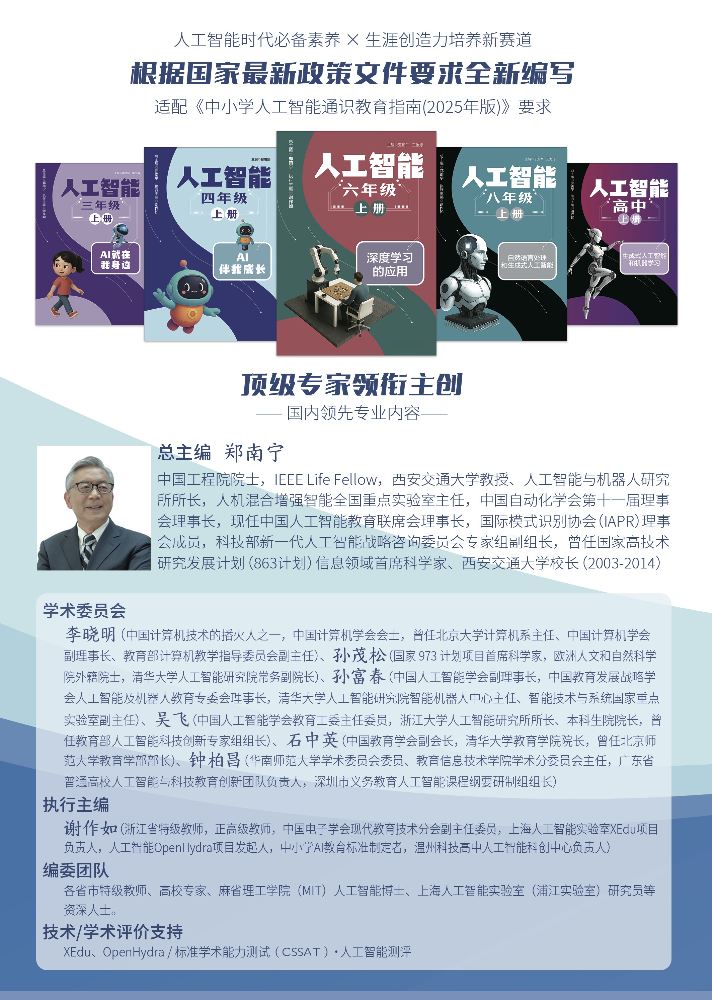
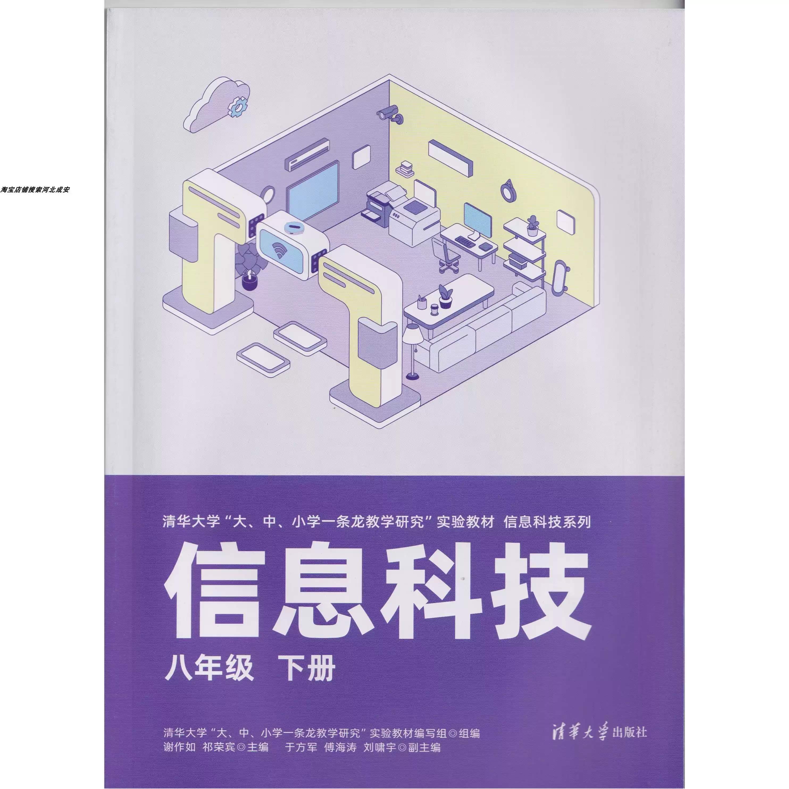
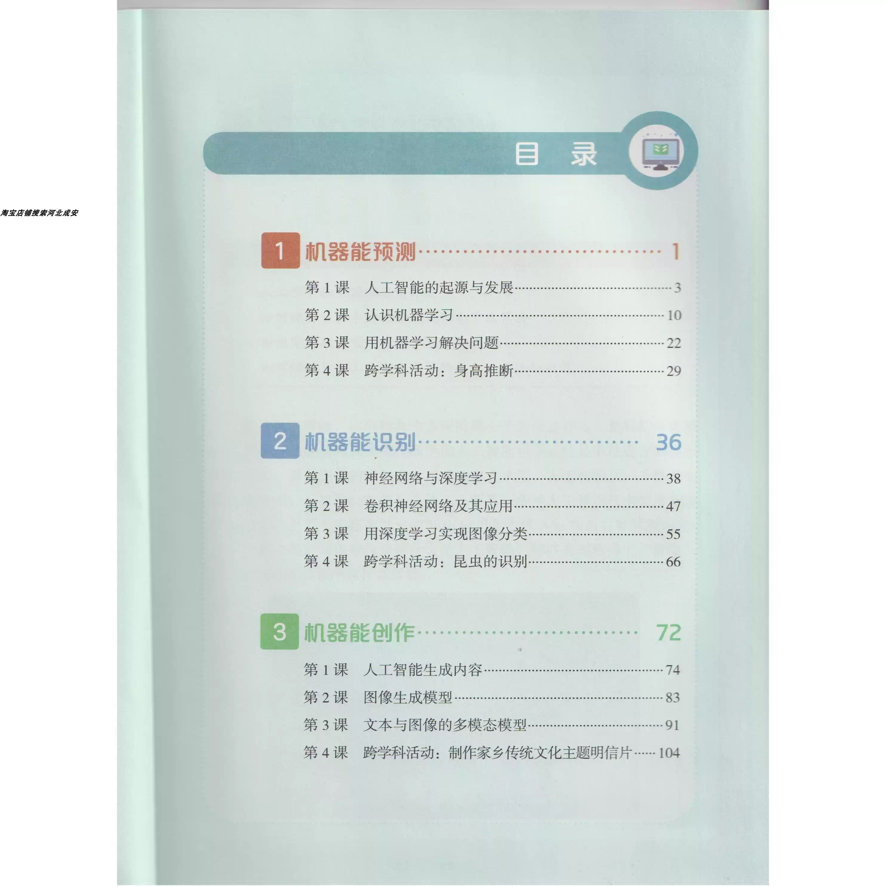
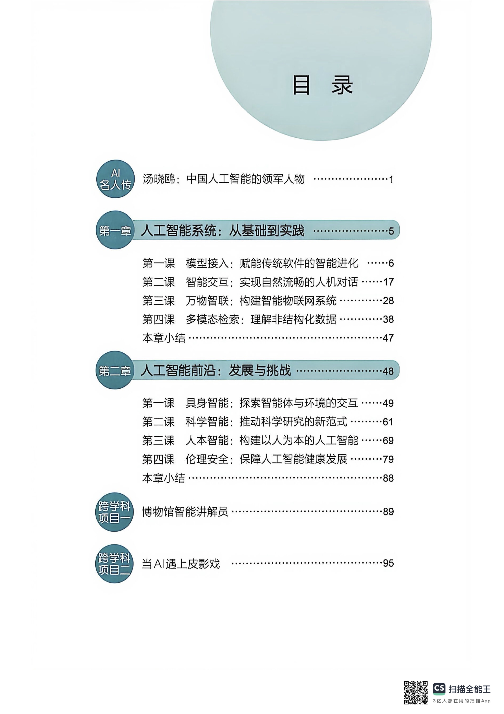

# 使用XEdu编写的教材

XEdu本来就是为青少年的人工智能教育而生，其低门槛、低代码、开箱即用的特点吸引了人工智能教育研究者的关注。只要教学内容中涉及模型训练和推理，XEdu几乎是中小学教材的唯一选择。

据不完全统计，有下列出版社的教材使用了XEdu系列工具。

## 清华大学出版社

清华大学出版社基础教育分社是XEdu项目的发起单位之一，其涉及到人工智能教育的教材，全部采用XEdu。

### 中小学人工智能通识

覆盖中小学不同学段，小学为从3年级到6年级，初中为7年级和8年级，高中为高一。每个学期1册。

基本信息：
- 主编：郑南宁
- 执行主编：谢作如
- 使用区域：新疆、四川、内蒙古、山东等

链接：https://detail.tmall.com/item.htm?abbucket=9&id=997332673594

### 中职人工智能通识

分为人工智能基础、职业场景中的人工智能应用、三个单元，采用项目式学习理念编写，共9个项目，计36课时。

链接：待上架

### 信息科技（初中）

清华大学出版社信息科技8年级下为人工智能，分为机器学习、深度学习、生成式人工智能等三个单元。

基本信息：
- ISBN编号：9787302676751
- 作者：谢作如 祁荣宾
- 使用区域：新疆、青海、贵州、湖南等

链接：https://item.taobao.com/item.htm?abbucket=9&id=885812687794

## 浙江教育出版社

先后发布两个版本，全部采用XEdu、Mind+等工具。其中有一个版本翻译为英语版本，在马来西亚使用。

基本信息：
- 主编：王万良
- 使用区域：河北、马来西亚等

## 广东教育出版社

